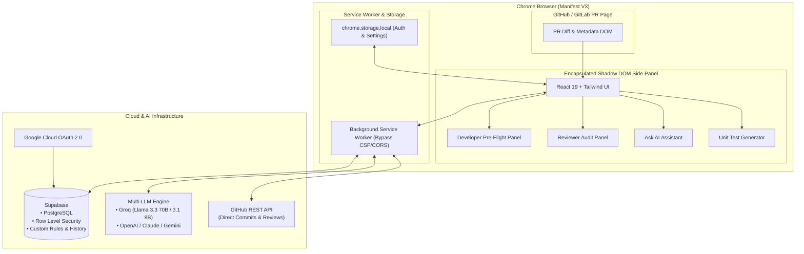

<div align="center">

  <h1>🤖 AI PR Copilot</h1>
  <p><strong>Next-Gen AI-Powered Pre-Flight Checks for Developers & Automated Security Audits for Reviewers on GitHub & GitLab Pull Requests.</strong></p>

  <p>
    <a href="https://github.com/Sushma-1206/ai-pr-copilot"></a>
    <a href="https://github.com/Sushma-1206/ai-pr-copilot"></a>
    <a href="https://github.com/Sushma-1206/ai-pr-copilot"></a>
    <a href="https://github.com/Sushma-1206/ai-pr-copilot"></a>
    <a href="https://github.com/Sushma-1206/ai-pr-copilot"></a>
    <a href="https://github.com/Sushma-1206/ai-pr-copilot"></a>
    <a href="https://github.com/Sushma-1206/ai-pr-copilot"></a>
  </p>

  <p>
    <a href="#-overview">Overview</a> •
    <a href="#-meet-the-team">Meet the Team</a> •
    <a href="#-dual-mode-experience">Dual-Mode Experience</a> •
    <a href="#-key-features">Key Features</a> •
    <a href="#-system-architecture">Architecture</a> •
    <a href="#-tech-stack">Tech Stack</a> •
    <a href="#-quick-start-guide">Quick Start</a> •
    <a href="#-database-setup-supabase">Database</a> •
    <a href="#-license">License</a>
  </p>

</div>

---

## 🌟 Overview

**AI PR Copilot** is a high-performance, developer-first Chrome Extension (Manifest V3) that redefines code reviews directly within **GitHub** and **GitLab**.

Injected safely inside an isolated **Shadow DOM**, AI PR Copilot eliminates context-switching and speeds up pull request workflows through two tailored, intelligent experiences:
1. **Developer Mode (Pre-Flight Checks)**: Catch runtime bugs, security vulnerabilities, edge cases, missing tests, and performance bottlenecks before you request a review—then apply AI-crafted fixes directly to your branch in a single click.
2. **Reviewer Mode (Auditing & Compliance)**: Accelerate reviews with high-level executive summaries, blast-radius risk assessments, custom team rule enforcement, automated review verdicts, and ready-to-publish inline feedback.

---

## 👥 Meet the Team

<div align="center">

| Contributor | GitHub Profile | Role & Contributions |
| :--- | :--- | :--- |
| 👩‍💻 **Sushma Kumari** | [@Sushma-1206](https://github.com/Sushma-1206) | **Project Lead & Core Maintainer**<br>Architecture, Multi-LLM Engine, Real-time DOM Extraction, Direct GitHub Commit & Batch Fixes |
| 👩‍💻 **Mariya Anjum** | [@MariyaAnjum937](https://github.com/MariyaAnjum937) | **Core Developer & Collaborator**<br>Reviewer Mode, Risk & Blast Radius Assessment, Custom Rules Engine, Supabase Auth |
| 👩‍💻 **Syeda Naazima Unnisa** | [@syeda007](https://github.com/syeda007) | **Core Developer & Collaborator**<br>Developer Experience, Missing Test Generation, UI/UX Glassmorphism & History Logs |

</div>

---

## 🎯 Dual-Mode Experience

AI PR Copilot is architected around two specialized workflows:

### 🚀 1. Developer / Contributor Mode
*Empowering authors to ship clean, bulletproof code before requesting peer review.*

- 📊 **PR Readiness Score & Circular Health Gauge:** Real-time visual score (0-100%) calculating code quality, security posture, test coverage, and documentation readiness.
- 🔍 **Granular Issue Classification:** Categorizes diff issues by severity (*Critical, High, Medium, Low*) and type (*Bugs, Security, Performance, Style, Types*).
- ⚡ **1-Click AI Fixes & Batch Commit:** Inspect side-by-side diff previews and automatically commit atomic code repairs directly to your GitHub branch. Includes SHA-mismatch 409 auto-retry and multi-file cross-edits.
- 🧪 **Automated Unit Test Generator:** Identifies untested edge cases and generates ready-to-run test suites (Jest, Vitest, Pytest, Go) with instant copy or commit options.
- 💬 **Context-Aware "Ask AI" Assistant:** Interactive chat panel equipped with full PR diff context to answer architectural questions, explain complex logic, or recommend refactors.
- 🤖 **Interactive Mascot Companion:** Real-time feedback companion offering contextual hints, analysis progress, and status alerts.

### 🧐 2. Reviewer / Auditor Mode
*Enabling senior engineers, tech leads, and security teams to review 10x faster with complete confidence.*

- 📋 **Executive PR Summary:** Plain-English breakdown of changes, impact, and architectural rationale.
- 💥 **Blast Radius & Risk Analysis:** Evaluates structural risks, database migration hazards, dependency updates, and breaking API contract changes.
- 🛡️ **Security & Compliance Audit:** Scans for secrets leakage, OWASP vulnerabilities, authorization loopholes, and sanitization lapses.
- 📏 **Custom Team Rules Engine:** Define and enforce project-specific coding standards (e.g., *"Require TypeScript strict types"*, *"No direct SQL queries"*, *"Enforce structured logging"*).
- ✍️ **Automated PR Review Verdicts & Comments:** Generates standardized, constructive GitHub review comments ready to post with one click (`APPROVE`, `REQUEST_CHANGES`, `COMMENT`).
- 📜 **Historical Review & Audit Logs:** Securely logs every audit session with Supabase PostgreSQL and Row Level Security (RLS).

---

## ✨ Key Features Matrix

| Feature | Developer Mode | Reviewer Mode | Description |
| :--- | :---: | :---: | :--- |
| **Instant PR Readiness Score** | ✅ | ✅ | Real-time 0-100% health calculation with actionable pass/warn/fail checklist. |
| **Automated Bug & Security Detection** | ✅ | ✅ | Catches logic flaws, race conditions, memory leaks, and injection vectors. |
| **1-Click Direct-to-GitHub Fixes** | ✅ | — | Commits AI-generated fixes directly to the active branch via background service worker. |
| **Batch Accepted Suggestions** | ✅ | — | Combines multiple file fixes into a single clean commit with conflict handling. |
| **Missing Unit Tests Generator** | ✅ | — | Synthesizes full unit test files tailored to your testing framework. |
| **Executive Summary & PR Verdict** | — | ✅ | Generates high-level summaries and official GitHub PR verdicts. |
| **Blast Radius & Breaking Change Audit**| — | ✅ | Pinpoints cascading effects on downstream APIs and shared components. |
| **Custom Rules Enforcement** | ✅ | ✅ | Enforces custom team guidelines stored in Supabase with RLS. |
| **Interactive Contextual AI Chat** | ✅ | ✅ | Ask questions specifically about the active PR diff and changed files. |
| **Zero-CORS Background Fetching** | ✅ | ✅ | Service worker routing bypasses CSP, CORS, and GitHub API rate limits. |
| **Encapsulated Shadow DOM UI** | ✅ | ✅ | Zero CSS leaks or styling collisions with GitHub / GitLab interfaces. |
| **Multi-LLM & Resilient Fallbacks** | ✅ | ✅ | Powered by Groq (Llama 3.3 70B & 3.1 8B), OpenAI, Anthropic, and Gemini. |

---

## 🏗️ System Architecture



---

## 🛠️ Tech Stack

- **Extension Framework:** Chrome Extension Manifest V3 (`@crxjs/vite-plugin`)
- **Frontend & UI:** React 19, Vite 8, Tailwind CSS, Lucide React Icons
- **Isolation:** Web Components Shadow DOM (prevents CSS conflicts with host pages)
- **AI & Intelligence Engine:**
  - **Groq Cloud:** Ultra-low latency inference with `llama-3.3-70b-versatile` & auto-cascading `llama-3.1-8b-instant`
  - **Multi-Provider Support:** OpenAI (GPT-4o), Anthropic (Claude 3.5 Sonnet), Google Gemini
- **Backend & Persistence:** Supabase (PostgreSQL, Row Level Security, Realtime, Supabase Auth)
- **Authentication:** Chrome Identity API (Google OAuth) + Supabase Auth LocalStorage Adapter

---

## 📁 Repository Structure

```text
ai-pr-copilot/
├── public/                     # Static extension assets & icons
├── src/
│   ├── background/             # Manifest V3 service worker (CORS/CSP bypass & API routing)
│   │   └── background.js
│   ├── components/             # React UI components (Glassmorphism & isolated styles)
│   │   ├── ApiKeyModal.jsx         # Custom LLM API configuration modal
│   │   ├── AskAIPanel.jsx          # Contextual PR chat assistant
│   │   ├── AuthPanel.jsx           # Supabase email & Google OAuth login UI
│   │   ├── BatchFixModal.jsx       # Batch code fix confirmation & multi-file commits
│   │   ├── CodeFixCard.jsx         # Inline code diff view & fix action buttons
│   │   ├── DeveloperPanel.jsx      # Developer mode main container
│   │   ├── DiffPreviewPanel.jsx    # Side-by-side diff review modal
│   │   ├── FixConfirmation.jsx     # Direct-to-GitHub commit dialog with conflict handling
│   │   ├── HistoryLogsPanel.jsx    # Historical scan & audit records viewer
│   │   ├── IssueCard.jsx           # Issue card with severity tags and AI suggestions
│   │   ├── IssuesPanel.jsx         # Filterable issue list (Bugs, Security, Style, Resolved)
│   │   ├── OverviewPanel.jsx       # Developer overview (Score, metrics, quick actions)
│   │   ├── ReadinessScore.jsx      # Animated circular gauge & readiness checklist
│   │   ├── ReviewerOverviewPanel.jsx# Reviewer executive summary, audit score & verdict
│   │   ├── ReviewerPanel.jsx       # Reviewer mode main container
│   │   ├── RiskPanel.jsx           # Blast radius, breaking change & migration risk panel
│   │   ├── RobotMascot.jsx         # Animated interactive robot assistant
│   │   ├── RulesPanel.jsx          # Custom team rules & compliance editor
│   │   └── TestsPanel.jsx          # AI missing unit test generator
│   ├── content/                # Injected content script & Shadow DOM root mount
│   │   └── content.jsx
│   ├── hooks/                  # Custom React hooks (useAuth, useRole, useStorage)
│   ├── lib/                    # Core libraries & integrations
│   │   ├── aiService.js            # Resilient multi-LLM orchestration & prompt engineering
│   │   ├── diffExtractor.js        # GitHub / GitLab DOM diff & file tree extractor
│   │   ├── githubService.js        # GitHub API client (commits, reviews, file trees)
│   │   ├── googleAuth.js           # Chrome Identity OAuth2 helper for Supabase
│   │   ├── rulesService.js         # Custom rules CRUD operations with Supabase
│   │   └── supabaseClient.js       # Supabase client with custom chrome.storage adapter
│   ├── popup/                  # Extension popup toolbar launcher
│   └── styles/                 # Global styles & Tailwind imports
├── supabase/                   # Database schemas, migrations & RLS policies
│   └── migrations/
├── manifest.config.js          # Manifest V3 specification
├── vite.config.js              # Vite bundler & CRXJS configuration
└── package.json
```

---

## 🚀 Quick Start Guide

### Prerequisites
- [Node.js](https://nodejs.org/) (v18 or higher)
- `npm` (v9 or higher)
- A free [Groq Cloud API Key](https://console.groq.com) (or OpenAI / Anthropic / Gemini key)
- A free [Supabase](https://supabase.com) account

---

### 📥 1. Installation

```bash
# Clone the repository
git clone https://github.com/Sushma-1206/ai-pr-copilot.git
cd ai-pr-copilot

# Install dependencies
npm install
```

---

### ⚙️ 2. Environment Configuration

Create a `.env` file in the project root:

```env
VITE_SUPABASE_URL=https://your-project-id.supabase.co
VITE_SUPABASE_ANON_KEY=your-supabase-anon-key
```

---

### 🔐 3. Google OAuth Setup (Optional for 1-Click Login)

1. In the [Google Cloud Console](https://console.cloud.google.com/), create a new **OAuth 2.0 Client ID** with Application Type: **Chrome Extension**.
2. Set the Extension ID to `abbdjaagnpegifekmkelmccahjigbdnp` (or your unpacked extension ID).
3. In **Supabase Dashboard → Authentication → Providers → Google**, enable Google sign-in and append the Client ID.

---

### 🔨 4. Build Extension

```bash
# Production Build
npm run build

# Or Watch Mode (Hot Module Replacement for active development)
npm run dev
```

---

### 🧩 5. Load Extension in Chrome

1. Open Google Chrome and navigate to `chrome://extensions`.
2. Toggle **Developer mode** in the top right corner.
3. Click **Load unpacked**.
4. Select the `dist/` directory inside your `ai-pr-copilot` folder.
5. Open any GitHub or GitLab Pull Request (e.g. `https://github.com/owner/repo/pull/123/files`) and start using AI PR Copilot!

---

## 🗄️ Database Setup (Supabase)

To enable persistent user sessions, project-level custom rules, and audit logs:

```bash
# Log in to Supabase CLI
npx supabase login

# Link your remote Supabase project
npx supabase link --project-ref YOUR_PROJECT_REF

# Push database schema & RLS policies
npx supabase db push
```

---

## 🔑 Supported AI Models

AI PR Copilot is equipped with an auto-cascading multi-LLM engine:

| Provider | Recommended Model | Use Case | Latency |
| :--- | :--- | :--- | :--- |
| **Groq (Default)** | `llama-3.3-70b-versatile` | Deep analysis, multi-file code fixes, test generation | ⚡ Ultra Fast (< 1.5s) |
| **Groq (Fallback)** | `llama-3.1-8b-instant` | High-throughput quick scans & pre-flight health checks | ⚡ Instant (< 0.5s) |
| **OpenAI** | `gpt-4o` | Complex architectural reasoning & security reviews | Fast |
| **Anthropic** | `claude-3-5-sonnet` | Nuanced code style auditing & deep logic synthesis | Fast |
| **Google** | `gemini-1.5-pro` | Large diff context processing | Fast |

---

## 🛡️ License

Distributed under the **MIT License**. See [`LICENSE`](LICENSE) for complete details.

---

<div align="center">

  <p>Crafted with ❤️ by <a href="https://github.com/Sushma-1206"><strong>Sushma Kumari</strong></a>, <a href="https://github.com/MariyaAnjum937"><strong>Mariya Anjum</strong></a>, and <a href="https://github.com/syeda007"><strong>Syeda Naazima Unnisa</strong></a>.</p>

  <p>⭐ <em>Star this repository if you find AI PR Copilot helpful!</em> ⭐</p>

</div>
